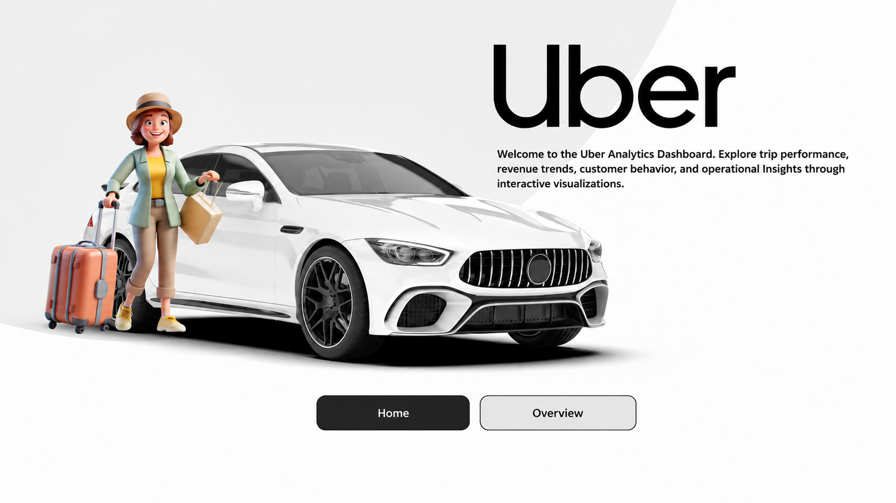
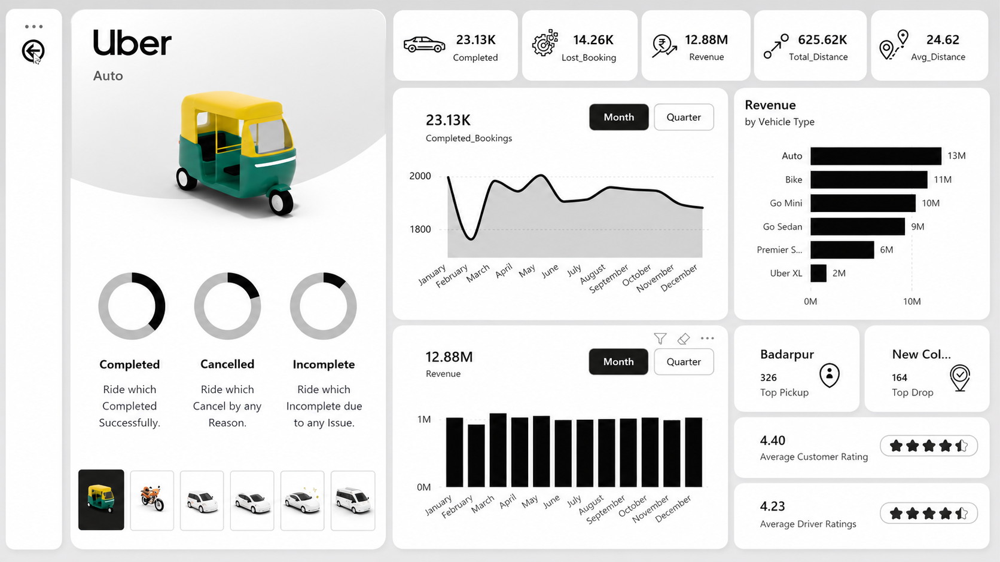

# Uber-Ride-Analysis-Dashboard-Power-BI-Project
# Project Overview

This project focuses on analyzing Uber ride booking data and transforming raw data into meaningful business insights using Power BI.

The objective of this dashboard is to understand booking patterns, customer behavior, ride performance, cancellations, and revenue trends through interactive visualizations and KPIs.

# Dashboard Preview

## Home Dashboard

## Overview Dashboard

# 1. Introduction to the Dataset
The dataset contains more than 150,000 Uber ride booking records and includes information related to bookings, customers, drivers, vehicle types, payments, and ride performance.

Dataset Fields:

- Booking ID
- Booking Date & Time
- Booking Status
- Vehicle Type
- Ride Distance
- Booking Value
- Payment Method
- Customer Rating
- Driver Rating
- Pickup Location
- Drop Location
- Cancellation Reasons

# Project Objective
To analyze ride booking data and build an interactive dashboard that helps stakeholders make data-driven business decisions.

# 2. Why Did I Choose This Project?
Uber is one of the world's largest ride-hailing companies that connects passengers and drivers through a mobile application. Every day, millions of rides are completed, generating a huge amount of valuable data.

I chose this project because the ride-booking industry provides real-world business scenarios and allows us to analyze:

- Customer booking behavior
- Revenue performance
- Ride demand trends
- Cancellation patterns
- Customer and driver satisfaction

This project gave me an opportunity to apply my data analytics skills to solve practical business problems and create meaningful insights from raw data.

# 3. Project Development Process
# Step 1: Data Understanding

- Explored the dataset and understood business requirements.
- Identified important columns and KPIs.
- Defined the project objectives.

# Step 2: Data Cleaning

- Checked for missing values.
- Removed duplicate records.
- Corrected inconsistent data.
- Standardized data formats.

# Step 3: Data Transformation

- Used Power Query for data preparation.
- Created required columns and transformed the dataset.
- Prepared data for analysis.

# Step 4: Data Modeling

- Built relationships between tables.
- Organized the data model for better performance.
- Applied best practices for reporting.

# Step 5: DAX Calculations
Created important KPIs such as:

- Total Bookings
- Total Revenue
- Successful Bookings
- Cancellation Percentage
- Average Ride Distance
- Average Customer Rating
- Average Driver Rating

# Step 6: Dashboard Development
Created interactive reports for:

- Booking Analysis
- Revenue Analysis
- Vehicle Type Analysis
- Cancellation Analysis
- Ratings Analysis
- Payment Method Analysis
- Pickup and Drop Location Analysis

# Step 7: Dashboard Interactivity
Implemented:

- Slicers
- Filters
- Dynamic Visuals
- KPI Cards
- Cross Filtering

# 4. Key Business Insights

- Identified booking trends and peak demand patterns.
- Analyzed cancellation reasons from both customers and drivers.
- Compared the performance of different vehicle types.
- Evaluated customer and driver satisfaction using ratings.
- Analyzed payment preferences and ride revenue.
- Generated insights that can support better business decisions and improve operational efficiency.

# 5. Tools & Technologies Used

- Power BI
- Power Query
- DAX
- Microsoft Excel
- Data Cleaning
- Data Modeling
- Data Visualization
- Business Intelligence

# 6. Conclusion
This project helped me gain hands-on experience in the complete data analytics workflow, from data preparation to dashboard development and business insight generation.

Through this project, I strengthened my skills in:

- Data Cleaning
- Data Transformation
- DAX Calculations
- Dashboard Design
- Business Analysis
- Data Storytelling

This dashboard demonstrates how raw data can be transformed into actionable insights that support data-driven decision-making.

